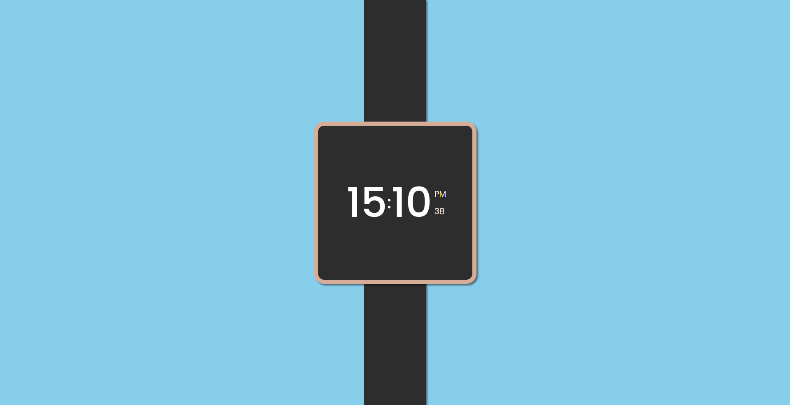

<h1 align="center">Relógio Digital</h1>

<h2> &#x231A; Projeto </h2>

 Esse é um projeto de uma relógio digital funcional em tempo real, estilizado em CSS.

<h2> &#x1F680; Link </h2>
<a href="https://davsilvam.github.io/relogio-digital/">Link para o projeto.</a>

<h2> &#x1F3A8; Visual do Projeto </h2>
<h1 align="center">

</h1>

<h2> &#x1FA90; Tecnologias </h2>

 Tecnologias utilizadas no projeto. 

 &#x1F7E0; HTML 

 &#x1F535; CSS 

 &#x1F7E1; JavaScript 

